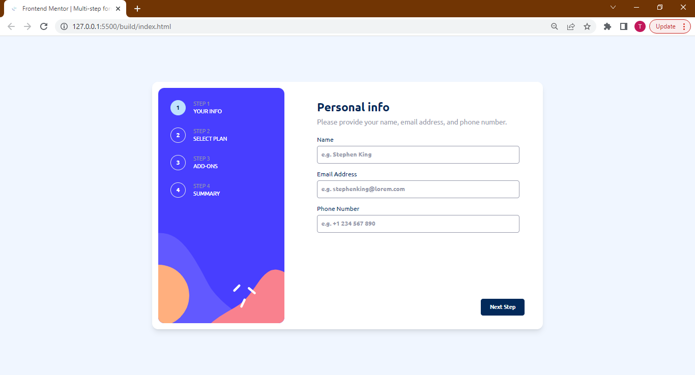
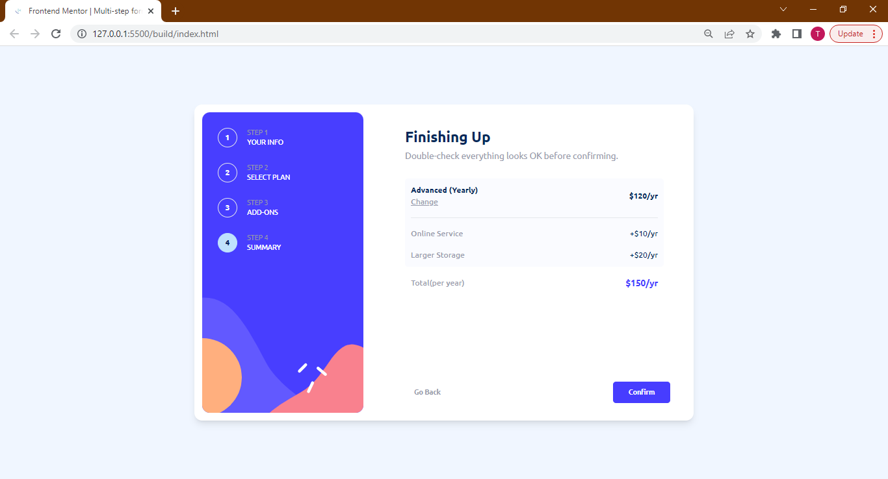

# Frontend Mentor - Multi-Step Form Solution

This is a solution to the [Multi-step form challenge on Frontend Mentor](https://www.frontendmentor.io/challenges/multistep-form-YVAnSdqQBJ).

## Table of Contents

- [Overview](#overview)
  - [The Challenge](#the-challenge)
  - [Screenshot](#screenshot)
  - [Links](#links)
- [My process](#my-process)
  - [Built with](#built-with)
  - [What I learned](#what-i-learned)
  - [Useful resources](#useful-resources)
- [Author](#author)
- [Acknowledgments](#acknowledgments)

## Overview

### The Challenge

Users should be able to:

- Complete each step of the sequence
- See a summary of their selections on the final step and confirm their order
- View the optimal layour for the interface depending on their device's screen size
- See hover and focus states for all interactive elements on the page

### Screnshot

### Links

- Solution URL: [View Code](https://)
- Live Site URL: [View Live](https://)

## My Process

### Built with

- Semantic HTML5 markup
- [Tailwind CSS](https://tailwindcss.com/) - CSS Framework
- Mobile-first workflow

### What I Learned

### Useful Resources

- [Tailwind Docs](https://tailwindcss.com/docs/) - This helped me search for Tailwind classes of certain styles I wanted to apply but couldn't remember.
- [How To Use Google Fonts In Tailwind CSS](https://hatchet.com.au/blog/how-to-use-google-fonts-in-tailwind-css/) - This article explained how to extend Tailwind's `fontFamily` theme to use fonts from Google Fonts.

## Author

- Twitter - [@DevDylan](https://www.twitter.com/DevDylan)

## Acknowledgements

[@dudeontwitter](https://twitter.com/dudeontwitter) really helped me in the last stages of this challenge where I happened to be stuck. I appreciate his efforts and the assistance he offered.
